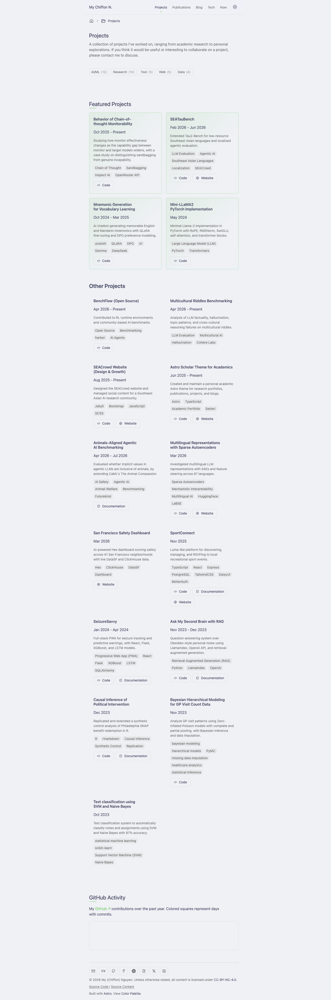
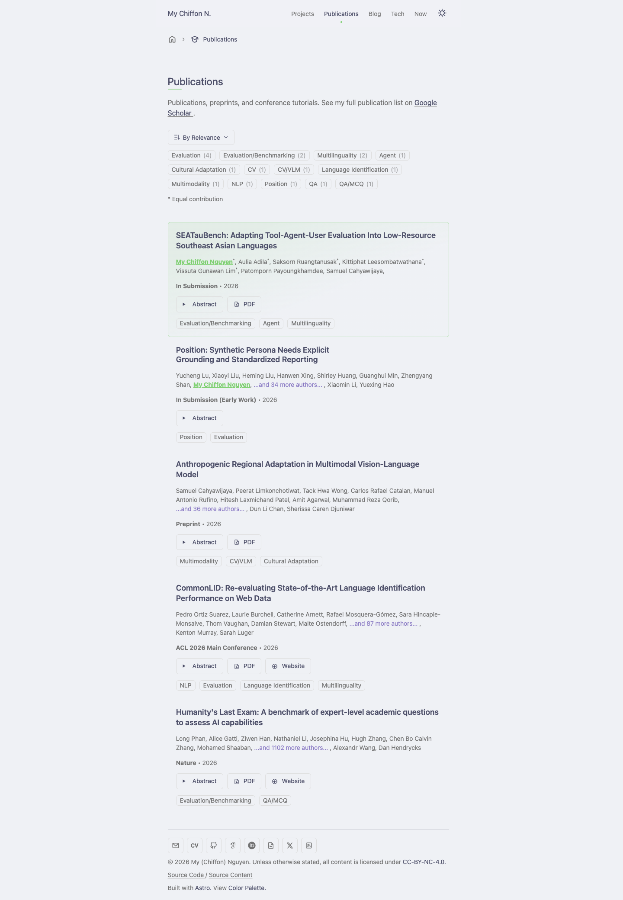

# Astro Scholar

[](https://github.com/mychiffonn/astro-scholar/releases) [](https://astro.build) [](https://www.typescriptlang.org/)


Astro Scholar is an Astro theme for academic personal sites, research blogs,
projects, publications, and now pages. It is currently being extracted from
[My (Chiffon) Nguyen's website](https://mychiffonn.com) into a reusable open
source template.

## Previews

| Home                                                | Projects                                                    |
| --------------------------------------------------- | ----------------------------------------------------------- |
|  |  |

| Publications                                                        | Uses                                                |
| ------------------------------------------------------------------- | --------------------------------------------------- |
|  |  |

## Features

- Fast static output with Astro 7.
- Academic profile, projects, updates, blog posts, authors, and publications.
- Publications rendered from a BibTeX file.
- Markdown-first writing with Sätteri, callouts, math, code highlighting, heading
  anchors, and sidenotes.
- Blog post/subpost system with tags, stages, table of contents, share actions,
  and multiple authors.
- Native CSS tokens for color, typography, spacing, shape, and motion.
- Local and Iconify-backed SVG icon system.
- Type-safe config and content schemas with Zod.
- RSS, sitemap, robots.txt, Open Graph metadata, and generated social images.

## Built With

This theme is built on enscribe's
[astro-erudite](https://github.com/jktrn/astro-erudite) v2.0.1 and references
from [Maggie Appleton](https://github.com/MaggieAppleton/maggieappleton.com-V3)'s
digital garden.

Version <2.0.0 uses Astro v6 & TailwindCSS.

## Getting Started

Have Node.js `>=22.12.0` and pnpm installed:

1. Clone the repository
2. Run `corepack enable`
3. Install dependencies: `pnpm install`
4. Start development server: `pnpm dev`
5. Visit `http://localhost:4321`
6. Read [docs/INSTALL.md](docs/INSTALL.md)
7. Customize with [docs/CUSTOMIZATION.md](docs/CUSTOMIZATION.md)

## Development

- [DEVELOPMENT.md](DEVELOPMENT.md): architecture, commands, Erudite v2
  principles, and theme publishing checklist.
- [CONTRIBUTING.md](CONTRIBUTING.md): contribution workflow and pull request
  expectations.

Common checks:

```bash
pnpm format:check
pnpm lint
pnpm astro check
pnpm build
```

## Publishing Checklist

- Create a fresh `astro-scholar` template repository.
- Create a separate deployed demo repo or deployment.
- Mark the GitHub repo as a template.
- Add GitHub topics: `astro`, `astro-theme`, `astro-template`, `academic`,
  `blog`, `portfolio`, `publications`, `research`.
- Add the live demo URL to the GitHub repository sidebar.
- Submit the demo and source repository to the Astro themes directory.
