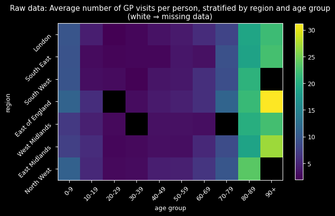
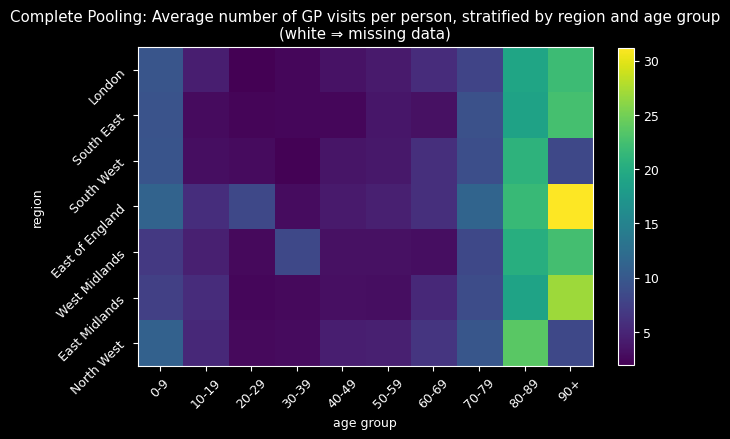
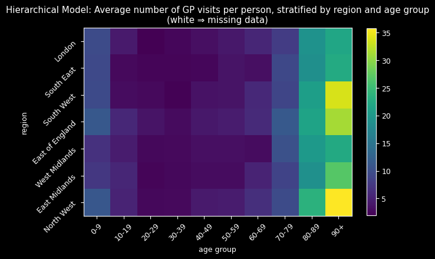

## The Challenge: When Healthcare Data Goes Missing

When analyzing general practitioner (GP) visit data across 7 regions and 10 age groups (30
individuals per group) in UK, I discovered a critical problem: entire age-region combinations were
completely missing. This wasn't random missingness: it followed systematic patterns that could bias
any analysis if handled naively.



The data revealed three key patterns: **zero-inflation** (far more people never visit doctors than a
standard Poisson would predict), **systematic missingness** (entire demographic groups absent), and
**clear age/regional effects** (older adults visit more, regional differences exist). With only
1,950 out of 2,100 observations present, I needed a method that could handle missing data while
capturing complex demographic relationships.

## Choosing the Right Statistical Framework

The excess zeros immediately ruled out standard count models, since a regular Poisson would severely
underestimate people who never visit doctors. I chose the Zero-Inflated Poisson (ZIP) model, which
splits the population into two groups: those who never visit (probability $\psi$) and those who do
visit (Poisson rate $\lambda$).

$$
y \sim \text{ZeroInflatedPoisson}(\psi, \lambda)
$$

This choice reflected the real-world reality that healthcare utilization has two distinct behavioral
patterns.

## Two Competing Approaches: Complete vs. Partial Pooling

I implemented two fundamentally different approaches to handle the 70 age-region combinations:

### Complete Pooling: One Size Fits All

Complete pooling assumes all groups share the same parameters—treating age and region as irrelevant.

For priors, I assume most people visit 0-2 times/year, so the number of visits follow a positive
Normal distribution, with mean of 2 and standard deviation of 15:

$$
\lambda \sim \text{Truncated-Normal}(2, 15^2, \text{lower}=0)
$$

and use uniform disitribution as uninformative prior for Zero-Inflated

$$
\psi \sim \text{Beta}(1,1)
$$

### Hierarchical Approach: Learning from Similarity

The hierarchical model allows each group to have its own parameters while sharing information across
similar groups—"borrowing strength." The key i nnovation was modeling log-rates as:

$$
\log(\lambda_{jk}) = \alpha + \beta_{\text{age}[j]} + \beta_{\text{region}[k]}
$$

With hierarchical priors that share information across groups:

$$
\beta_{\text{age}} \sim \text{Normal}(\mu_{\text{age}}, \sigma_{\text{age}}^2)
$$

$$
\beta_{\text{region}} \sim \text{Normal}(\mu_{\text{region}}, \sigma_{\text{region}}^2)
$$

This structure is particularly powerful for missing data imputation because it can leverage patterns
from similar groups.

## The Moment of Truth: Model Performance

Using PyMC with BlackJAX NUTS sampling (4 chains, 1,000 samples each), I compared the two
approaches. The results were striking: the hierarchical model achieved an ELPD-LOO of -6,131
compared to -10,967 for complete pooling—dramatically better out-of-sample predictions with 0.88
model weight and lower standard error (113 vs. 334).

But the most compelling evidence came from visualizing the imputed missing data:





Complete pooling (top) imputed all missing values around 8-9 visits—treating every group as average.
The hierarchical model (bottom) successfully reconstructed missing combinations by learning from
similar groups, correctly identifying that older adults (80+) should have higher visit rates while
younger adults (20-29) should have lower rates.

The hierarchical approach's sophisticated imputation process—extracting group-specific parameters
and reconstructing ZIP distributions—naturally incorporated learned age-region relationships. The
results spoke for themselves: realistic imputations following expected demographic patterns versus
implausible uniform estimates.

## Key Insights: What the Data Revealed

This analysis yielded several important insights that extend beyond the immediate problem:

**Zero-inflation is a real phenomenon**—the excess zeros weren't just statistical noise but
reflected genuine behavioral patterns in healthcare utilization. Many people genuinely avoid
doctors, while others follow more predictable visit patterns.

**Demographic effects are crucial**—age and region matter significantly for healthcare utilization.
The hierarchical model's ability to capture these effects was essential for accurate imputation and
understanding.

**Partial pooling wins decisively**—the ability to share information across groups while allowing
for group-specific effects led to dramatically better predictions. This "borrowing strength" concept
proved its value in practice.

**Missing data can be informative**—the systematic patterns in missingness suggested that simple
imputation methods would fail. The hierarchical approach's success demonstrated the importance of
modeling the missing data mechanism.

## Key Technical Implementation

The hierarchical model elegantly translates mathematical concepts to code:

```python
with pm.Model(coords=coords) as hierarchical_model:
    # Hyperpriors and group-specific effects
    sigma_region = pm.Exponential("sigma_region", lam=1)
    beta_region = pm.Normal("beta_region", dims="region",
                           mu=mu_region, sigma=sigma_region)

    # Linear predictor combining age and region effects
    lambda_ = pm.Deterministic("lambda",
                              pm.math.exp(alpha + beta_region[region_idx] +
                                        beta_age[age_idx]))

    # ZIP likelihood handling zero-inflation
    likelihood = pm.ZeroInflatedPoisson("y", psi=psi, mu=lambda_, observed=counts)
```

The imputation process leverages learned group-specific parameters to reconstruct missing data
naturally.

## Real-World Impact and Skills Developed

This methodology addresses critical challenges in healthcare analytics where missing data is common
and demographic effects are crucial. The hierarchical approach provides a principled framework for
healthcare resource allocation, clinical research, public health surveillance, and epidemiological
modeling.

The techniques are directly applicable to hospital admissions, medication adherence studies, and any
domain where count data exhibits zero-inflation and systematic missingness.

This project developed expertise in advanced Bayesian modeling, probabilistic programming with PyMC,
MCMC diagnostics, missing data methodology, and model comparison. Most importantly, it taught me to
think probabilistically about uncertainty and embrace the complexity of real-world data rather than
forcing it into oversimplified models.
